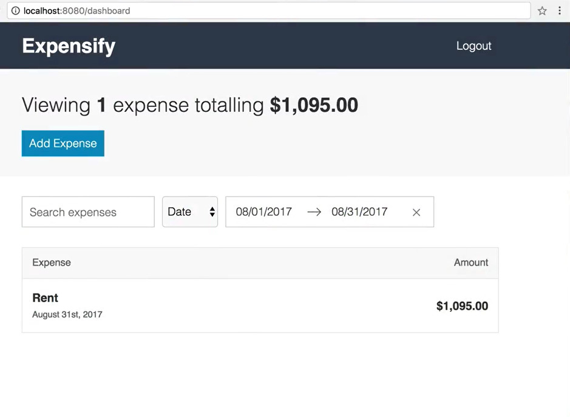
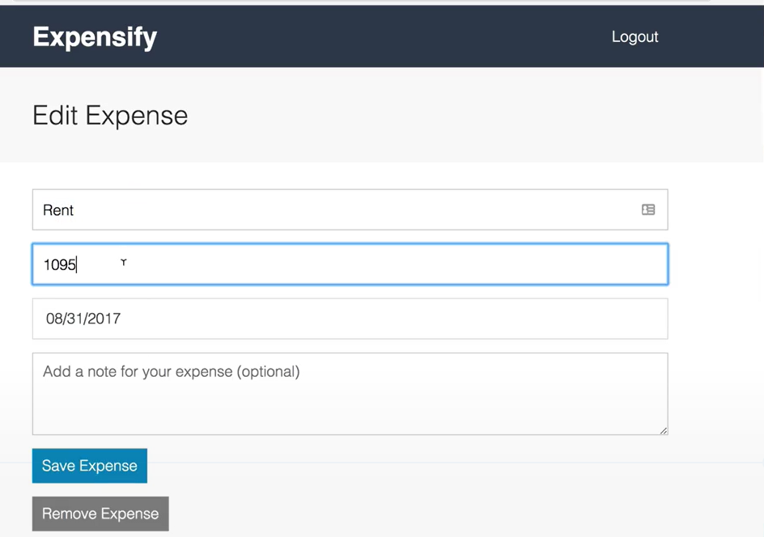

## Fullstack-Ecommerce-site

## About

 `this is  my learning based project done 90% work, this is expense store where people can note their expense and search `
 

## Feature
- `Welcome Expensify,`

- `Expensify editing`

## Following technologies are used

- `React`
  - `React-router`
  - `react-lazyload`
  - `react-loadable`
  - `react-load-script`
  - `react-dom`
  - `react-router-dom`
  - `react-cropper`
   - `react-slider`

- `Firebase`

  
 
     

## Supported Browsers

`By default, the generated project supports all modern browsers.`  
   

## Scripts

- `npm run clean` Deletes Build files of Server and Client
- `npm run build` Builds Server and Client
- `npm  run server` Start server in production environment

                                                                                                                                                                                                                                                                                                                                                                     
